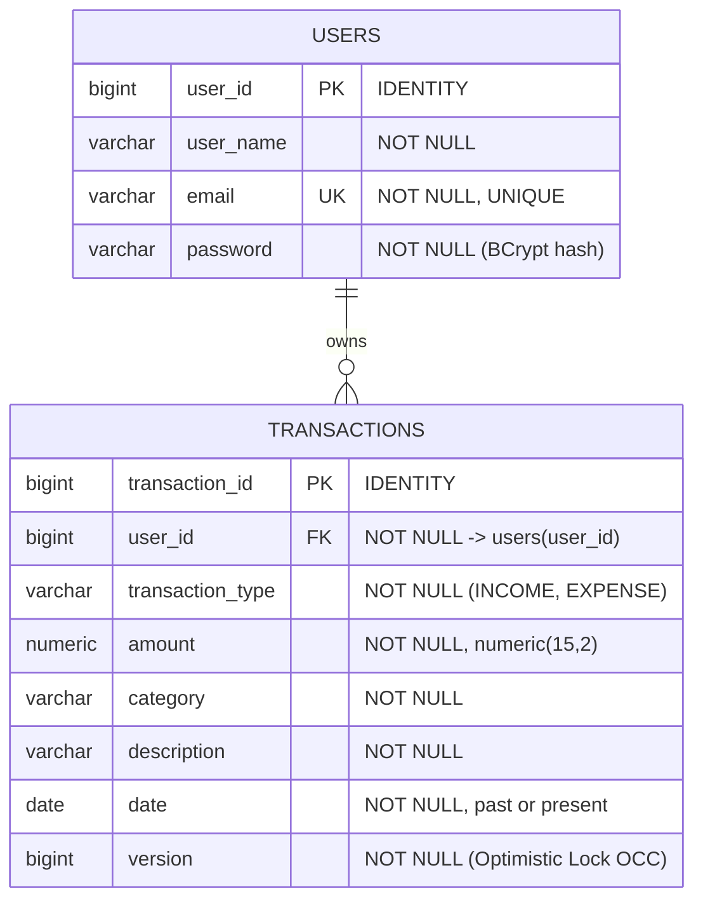
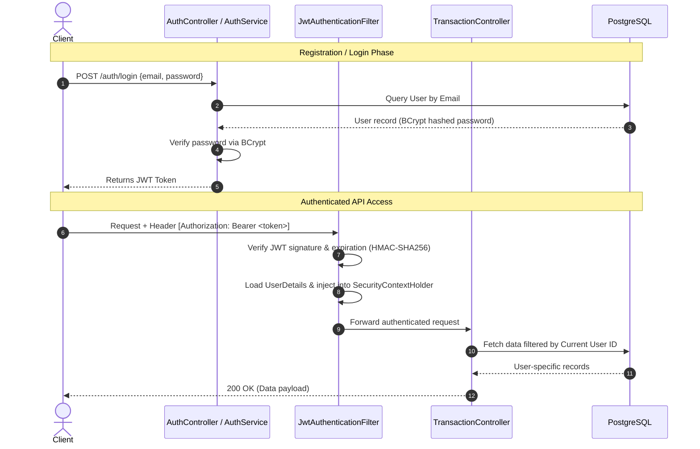

# 💸 Personal Finance & Investment Tracker API

A secure, scalable RESTful backend service built with **Spring Boot**, **Spring Security**, **JPA / Hibernate**, and **PostgreSQL** to manage personal finances, track multi-category transactions, and compute balance summaries with user-level data isolation and JWT-based authentication.

---

## 📑 Table of Contents

- [Overview](#-overview)
- [Key Features](#-key-features)
- [Technology Stack](#-technology-stack)
- [Architecture & Design](#-architecture--design)
- [Database Schema & ER Diagram](#-database-schema--er-diagram)
- [Security & Authentication Flow](#-security--authentication-flow)
- [API Documentation](#-api-documentation)
  - [Authentication Endpoints](#1-authentication-endpoints-auth)
  - [Transaction Endpoints](#2-transaction-endpoints-transactions)
- [Getting Started](#-getting-started)
  - [Prerequisites](#prerequisites)
  - [Configuration](#configuration)
  - [Build and Run](#build-and-run)
  - [Running Tests](#running-tests)
- [Project Structure](#-project-structure)
- [Engineering Best Practices & Roadmap](#-engineering-best-practices--roadmap)

---

## 🌟 Overview

Managing personal finances requires both data consistency and secure access controls. The **Personal Finance Tracker API** provides an enterprise-grade foundation for income and expense management, ensuring that every financial transaction is securely tied to its authenticated owner. The application features stateless JWT authentication, password hashing with BCrypt, structured validation, centralized exception handling, and optimized aggregation queries.

---

## 🚀 Key Features

- **Stateless Authentication**: Fast, secure user registration and login powered by JSON Web Tokens (HMAC-SHA256) and Spring Security filters.
- **Strict User-Level Data Isolation**: All transactions are scoped to the authenticated user's principal extracted directly from the security context, preventing horizontal privilege escalation.
- **Comprehensive Transaction Management**: Complete lifecycle support for income and expense logging, category filtering, updates, and deletion.
- **Financial Analytics & Summary**: Aggregated calculations for total income, total expenditure, and net balance via optimized JPQL aggregate queries.
- **Robust Input Validation & Error Handling**: Validation annotations (`@Valid`, `@Positive`, `@PastOrPresent`, `@NotBlank`) paired with a centralized `@RestControllerAdvice` delivering standardized, structured error responses.
- **Unit Tested Services**: Core authentication workflows tested with JUnit 5 and Mockito.

---

## 🛠 Technology Stack

| Layer | Technology |
|---|---|
| **Language & Runtime** | Java 21+ |
| **Framework** | Spring Boot, Spring MVC |
| **Security** | Spring Security, JJWT (`io.jsonwebtoken` 0.13.0), BCrypt |
| **Persistence / ORM** | Spring Data JPA, Hibernate |
| **Database** | PostgreSQL |
| **Build & Dependency Tool** | Apache Maven |
| **Testing** | JUnit 5, Mockito, Spring Security Test |
| **Utilities** | Project Lombok |

---

## 🏛 Architecture & Design

The project strictly follows layered enterprise architecture principles:

```
[ HTTP Requests ]
       │
       ▼
[ Security Filter Chain: JwtAuthenticationFilter ]
       │
       ▼
[ Controller Layer: AuthController / TransactionController ]
       │ (DTOs / Requests)
       ▼
[ Service Layer: AuthService / TransactionService / CustomUserDetailsService ]
       │ (Business Logic, Validation, Ownership Verification)
       ▼
[ Data Access Layer (DAO): UserDao / TransactionDao ]
       │ (Spring Data JPA / JPQL Aggregations)
       ▼
[ Relational Database: PostgreSQL ]
```

---

## 🗄 Database Schema & ER Diagram

The database uses a normalized relational schema with foreign key integrity:



### Implemented Composite B-Tree Indexes
To prevent full table sequential scans (`Seq Scan`) and maintain sub-millisecond p95 latency on high-volume transaction histories:
- **`idx_tx_user_date` (`user_id, date`)**: Optimizes chronological account history queries (`ORDER BY date DESC`).
- **`idx_tx_user_category` (`user_id, category`)**: Eliminates table scans during category-based filtering.
- **`idx_tx_user_type` (`user_id, transaction_type`)**: Accelerates aggregate summation queries (`sumByUserAndType`).
- **`users(email)`**: Unique B-Tree index ensuring $O(1)$ user lookups during authentication and preventing race conditions during registration.

### ACID Boundaries & Concurrency Control
- **Optimistic Concurrency Control (OCC)**: Managed via JPA `@Version` on `Transaction`. Concurrent mutations targeting the same transaction are detected at commit time, triggering an `ObjectOptimisticLockingFailureException` (handled by `GlobalExceptionHandler` returning `409 Conflict`), preventing lost updates.
- **Transaction Boundaries**: Strict `@Transactional(isolation = Isolation.READ_COMMITTED)` boundaries ensure that mutating operations are executed within isolated, atomic database transactions with automatic rollback on runtime exceptions.
- **Strict Tenant Isolation**: All read and write operations enforce user-ownership checks at the query level (`findByTransactionIdAndUser`, `deleteByUserAndTransactionId`), preventing Insecure Direct Object Reference (IDOR) attacks.

---

## 🔒 Security & Authentication Flow



---

## 📡 API Documentation

### Base URL
```
http://localhost:8080
```

### 1. Authentication Endpoints (`/auth`)

#### Register a New User
- **Method**: `POST`
- **Endpoint**: `/auth/register`
- **Request Body**:
  ```json
  {
    "userName": "Shivam Jhanwar",
    "email": "shivam@example.com",
    "password": "SecurePassword123!"
  }
  ```
- **Response**: `200 OK`
  ```json
  {
    "token": "eyJhbGciOiJIUzI1NiJ9..."
  }
  ```

#### Login
- **Method**: `POST`
- **Endpoint**: `/auth/login`
- **Request Body**:
  ```json
  {
    "email": "shivam@example.com",
    "password": "SecurePassword123!"
  }
  ```
- **Response**: `200 OK`
  ```json
  {
    "token": "eyJhbGciOiJIUzI1NiJ9..."
  }
  ```

---

### 2. Transaction Endpoints (`/transactions`)
> ⚠️ **Note**: All endpoints below require the `Authorization` header:  
> `Authorization: Bearer <your-jwt-token>`

#### Add a Transaction
- **Method**: `POST`
- **Endpoint**: `/transactions/add`
- **Request Body**:
  ```json
  {
    "transactionType": "EXPENSE",
    "amount": 250.50,
    "category": "Groceries",
    "description": "Weekly supermarket essentials",
    "date": "2026-10-05"
  }
  ```
- **Response**: `200 OK`
  ```text
  Transaction added successfully
  ```

#### Get All User Transactions
- **Method**: `GET`
- **Endpoint**: `/transactions`
- **Response**: `200 OK`
  ```json
  [
    {
      "transactionId": 1,
      "transactionType": "EXPENSE",
      "amount": 250.50,
      "category": "Groceries",
      "description": "Weekly supermarket essentials",
      "date": "2026-10-05",
      "userId": 1
    }
  ]
  ```

#### Filter Transactions by Category
- **Method**: `GET`
- **Endpoint**: `/transactions/{category}`
- **Example**: `GET /transactions/Groceries`
- **Response**: `200 OK`

#### Update an Existing Transaction
- **Method**: `PUT`
- **Endpoint**: `/transactions/edit`
- **Request Body**:
  ```json
  {
    "transactionId": 1,
    "transactionType": "EXPENSE",
    "amount": 275.00,
    "category": "Groceries",
    "description": "Updated supermarket bill with fruits",
    "date": "2026-10-05"
  }
  ```
- **Response**: `200 OK`
  ```text
  Transaction edited successfully
  ```

#### Delete a Transaction
- **Method**: `DELETE`
- **Endpoint**: `/transactions/delete/{id}`
- **Example**: `DELETE /transactions/delete/1`
- **Response**: `200 OK`
  ```text
  Transaction deleted successfully
  ```

#### Get Financial Summary
- **Method**: `GET`
- **Endpoint**: `/transactions/summary`
- **Response**: `200 OK`
  ```json
  {
    "totalIncome": 50000.00,
    "totalExpense": 12500.50,
    "totalBalance": 37499.50
  }
  ```

---

## ⚡ Getting Started

### Prerequisites
- **JDK 21** or later installed
- **PostgreSQL 14+** running locally or via Docker
- **Maven 3.9+** (or use the included `./mvnw` wrapper)

### Configuration

Update your database credentials and secret key in `src/main/resources/application.yaml`:

```yaml
spring:
  application:
    name: tracker
  datasource:
    url: jdbc:postgresql://localhost:5432/finance
    username: postgres
    password: your_password
    driver-class-name: org.postgresql.Driver
  jpa:
    hibernate:
      ddl-auto: update
    show-sql: true
    properties:
      hibernate:
        format_sql: true

jwt:
  secret: "f1ecfe9021f661852ca5e8a6a01040fc9e4506863727627c510a2b6e3902a2b9"
  expiration: 3600000 # in ms (1 hour)
```

Ensure the database exists in PostgreSQL:
```sql
CREATE DATABASE finance;
```

### Build and Run

1. **Clone the repository**:
   ```bash
   git clone https://github.com/jhanwar-shivam/Finance-Tracker.git
   cd Finance-Tracker
   ```

2. **Build the project**:
   ```bash
   ./mvnw clean compile
   ```

3. **Run the Spring Boot application**:
   ```bash
   ./mvnw spring-boot:run
   ```
   The application will start on `http://localhost:8080`.

### Running Tests
Execute unit tests using Maven Surefire:
```bash
./mvnw test
```

---

## 📂 Project Structure

```
tracker/
├── src/
│   ├── main/
│   │   ├── java/com/finance/tracker/
│   │   │   ├── TrackerApplication.java        # Main Spring Boot entry point
│   │   │   ├── config/                        # Security & filter configurations
│   │   │   │   ├── JwtAuthenticationFilter.java
│   │   │   │   └── SecurityConfig.java
│   │   │   ├── controller/                    # REST API Controllers
│   │   │   │   ├── AuthController.java
│   │   │   │   └── TransactionController.java
│   │   │   ├── dao/                           # Spring Data JPA Repositories
│   │   │   │   ├── TransactionDao.java
│   │   │   │   └── UserDao.java
│   │   │   ├── dto/                           # Data Transfer Objects
│   │   │   │   ├── ErrorDTO.java
│   │   │   │   ├── LoginAndRegisterResponseDTO.java
│   │   │   │   ├── LoginRequestDTO.java
│   │   │   │   ├── RegisterResuestDTO.java
│   │   │   │   ├── SummaryDTO.java
│   │   │   │   └── TransactionDTO.java
│   │   │   ├── exception/                     # Global & Custom Exception Handling
│   │   │   │   ├── GlobalExceptionHandler.java
│   │   │   │   └── ...
│   │   │   ├── model/                         # JPA Entities & Enums
│   │   │   │   ├── CustomUserDetails.java
│   │   │   │   ├── Transaction.java
│   │   │   │   ├── TransactionType.java
│   │   │   │   └── User.java
│   │   │   ├── service/                       # Business Logic Layer
│   │   │   │   ├── AuthService.java
│   │   │   │   ├── CustomUserDetailsService.java
│   │   │   │   └── TransactionService.java
│   │   │   └── utils/                         # Token utilities (JJWT)
│   │   │       └── JWTUtil.java
│   │   └── resources/
│   │       └── application.yaml               # Database & JWT properties
│   └── test/
│       └── java/com/finance/tracker/          # Unit & Integration Tests
│           ├── TrackerApplicationTests.java
│           └── service/AuthServiceTest.java
├── pom.xml                                    # Maven Dependencies & Plugins
└── README.md
```

---

## 🔮 Engineering Roadmap & Enhancements

- [ ] **Pagination & Sorting**: Support `Pageable` parameters on `/transactions` to handle large datasets efficiently.
- [ ] **Date-Range Filtering**: Support filtering transactions between `startDate` and `endDate`.
- [ ] **Optimistic Locking**: Add `@Version` field to `Transaction` entity to safeguard against concurrent lost updates.
- [ ] **Database Migration Tooling**: Integrate **Flyway** or **Liquibase** for version-controlled, production-safe database migrations.
- [ ] **Automated Integration Tests**: Implement `@SpringBootTest` with Testcontainers (PostgreSQL container) for end-to-end API regression testing.

---

## 📄 License
This project is open-source and available under the [MIT License](LICENSE).
